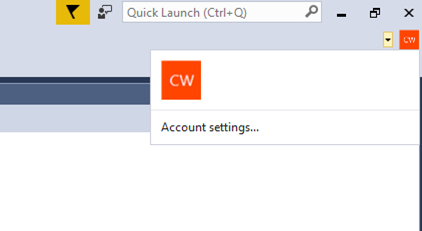
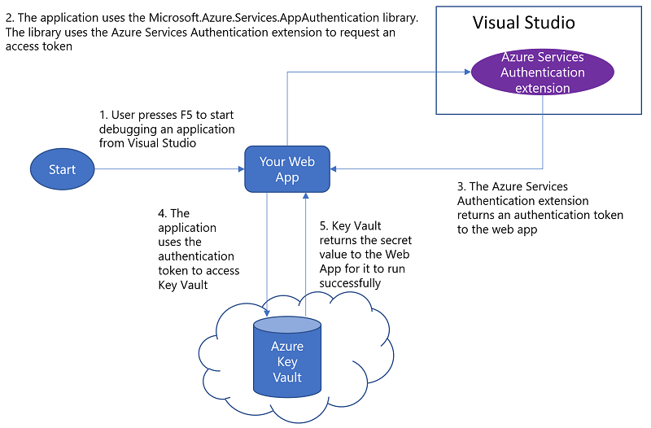
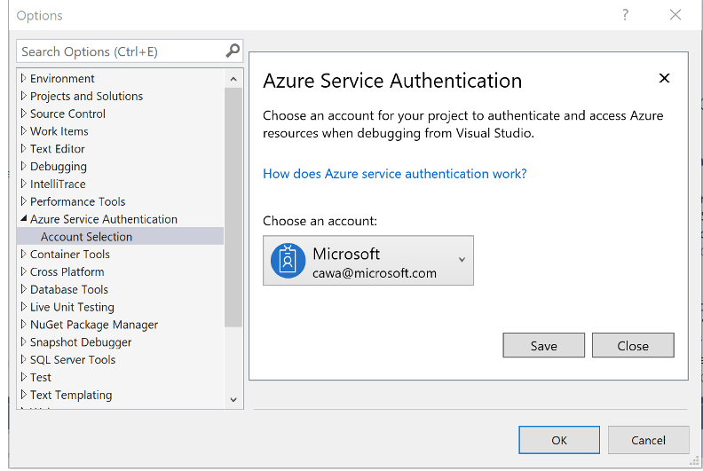

# Use Key Vault from App Service with Managed Service Identity

## Background
For Service-to-Azure-Service authentication, the approach so far involved creating an Azure AD application and associated credential, and using that credential to get a token. The sample [here](https://docs.microsoft.com/en-us/azure/key-vault/key-vault-use-from-web-application) shows how this approach is used to authenticate to Azure Key Vault from a Web App. While this approach works well, there are two shortcomings:
1. The Azure AD application credentials are typically hard coded in source code. Developers tend to push the code to source repositories as-is, which leads to credentials in source.
2. The Azure AD application credentials expire, and so need to be renewed, else can lead to application downtime.
3. Requires changing source code. Ideally we want to keep all the changes at configuration level and minimize the amount of source code change.

With [Managed Service Identity (MSI)](https://docs.microsoft.com/en-us/azure/app-service/app-service-managed-service-identity), and new ASP.NET configuration builders, all these problems are solved. This sample shows how a Web App can authenticate to Azure Key Vault without the need to manage Azure AD credentials and to change source code.

## Prerequisites
To run and deploy this sample, you need the following:
1. An Azure subscription to create an App Service and a Key Vault.
    * [Create your Azure free account today](https://azure.microsoft.com/en-us/free/)
2. [Visual Studio 2017 update 5](https://www.visualstudio.com/vs/preview/)
    * Install Web development and Azure development workloads.    
3. [Azure Services Authentication Extension](https://go.microsoft.com/fwlink/?linkid=862354). To go Visual Studio *Tools | Extensions and Updates* and search for *Azure Services Authentication* online to install the extension.
4. [.NET Framework 4.7.1](https://www.microsoft.com/en-us/download/details.aspx?id=56115) and [.NET 4.7.1 Targeting Pack for Development](https://www.microsoft.com/en-us/download/confirmation.aspx?id=56119)

## Step 1: Create an App Service with a Managed Service Identity (MSI) and Key Vault
<a href="https://portal.azure.com/#create/Microsoft.Template/uri/https%3A%2F%2Fraw.githubusercontent.com%2FAzure-Samples%2Fapp-service-msi-keyvault-dotnet%2Fmaster%2Fazuredeploy.json" target="_blank">
    
</a>

Use the "Deploy to Azure" button to create the following resources:
1. App Service with MSI
2. Key Vault with a secret
3. A Key Vault access policy that grants the App Service access to **Get Secrets**

>Note: When filling out the template you will see a textbox labelled 'Key Vault Secret'. Enter your secret value there. A secret in Key Vault with the name 'secret' and value from what you entered will be created in the Key Vault.

Review the resources created using the Azure portal. You should see an App Service and a Key Vault. View the access policies of the Key Vault to see that the App Service has access to it.

## Step 2: Grant yourself data plane access to the Key Vault
Using the Azure Portal, go to the Key Vault's access policies, and grant yourself **Secret Management** access to the Key Vault. This will allow you to run the application on your local development machine.

1.	Search for your Key Vault in “Search Resources dialog box” in Azure Portal.
2.	Select "Overview", and click on Access policies
3.	Click on "Add New", select "Secret Management" from the dropdown for "Configure from template"
4.	Click on "Select Principal", add your account
5.	Save the Access Policies

## Step 3: Clone the repo
Clone the repo to your development machine.

The project includes the following Nuget packages:
```Microsoft.Configuration.ConfigurationBuilders.Azure``` - Enables an application to use Key Vault as a configuration store without changing source code

The HomeController Index class reads a configuration setting through ConfigurationManager class, without any code change

```csharp    
public async System.Threading.Tasks.Task<ActionResult> Index()
       {

           try
           {

               var secret = ConfigurationManager.AppSettings["secret"];

               ViewBag.Secret = $"Secret: {secret}";

           }
```

In web.config file, specify the Key Vault as a configuration source
```xml
<configBuilders>
   <builders>
     <add name="AzureKeyVault" vaultName="replace_with_your_KeyVault_Name" type="Microsoft.Configuration.ConfigurationBuilders.AzureKeyVaultConfigBuilder, Microsoft.Configuration.ConfigurationBuilders.Azure, Version=1.0.0.0, Culture=neutral" />
   </builders>
 </configBuilders>
 <appSettings configBuilders="AzureKeyVault">
   <add key="webpages:Version" value="3.0.0.0" />
   <add key="webpages:Enabled" value="false" />
   <add key="ClientValidationEnabled" value="true" />
   <add key="UnobtrusiveJavaScriptEnabled" value="true" />
   <add key="secret" value="" />
 </appSettings>
```
* Add your Key Vault to the configBuilders section
* Apply Key Vault configuration builder to the appSetting section
* Add the setting key to the appSettings section with a dummy value. This value will be replaced by what's in the Key Vault.

If you are just doing a quick prototype and don't want to provision any Azure resources, use the Secrets configuration builder. It saves secrets to a file outside of project folder to prevent secrets from being leaked in source control.

```xml
<configBuilders>
   <builders>
     <add name="SecretsFile" secretsFile="C:\Users\AppData\Local\secret.xml" type="Microsoft.Configuration.ConfigurationBuilders.UserSecretsConfigBuilder, Microsoft.Configuration.ConfigurationBuilders, Version=1.0.0.0, Culture=neutral" />
   </builders>
 </configBuilders>
 <appSettings configBuilders="SecretsFile">
   <add key="webpages:Version" value="3.0.0.0" />
   <add key="webpages:Enabled" value="false" />
   <add key="ClientValidationEnabled" value="true" />
   <add key="UnobtrusiveJavaScriptEnabled" value="true" />
   <add key="secret" value="" />
 </appSettings>
```


## Step 4: Run the application on your local development machine
Sign-in to Visual Studio using your Azure account.



The Key Vault configuration builder will use the Visual Studio sign-in account to get a token to authenticate to Key Vault. This removes the need to create a service principal, and share it with the development team. It also prevents credentials from being checked in to source code.  



Since your developer account has access to the Key Vault, you should see the secret on the web page. Principal Used will show type "VisualStudio" and your user account.

For more information about .NET 4.7.1 Key Vault and Secret configuration builders, see [Announcing .NET 4.7.1 Tools for the Cloud](https://blogs.msdn.microsoft.com/webdev/2017/11/17/announcing-net-4-7-1-tools-for-the-cloud/)

## Step 6: Deploy the Web App to Azure
Use any of the methods outlined on [Deploy your app to Azure App Service](https://docs.microsoft.com/en-us/azure/app-service-web/web-sites-deploy) to publish the Web App to Azure.
After you deploy it, browse to the web app. You should see the secret on the web page, and this time the Principal Used will show "App", since it ran under the context of the App Service.
The AppId of the MSI will be displayed.

## Summary
The web app was successfully able to get a secret at runtime from Azure Key Vault using your developer account during development, and using MSI when deployed to Azure, without any code change between local development environment and Azure.
As a result, you did not have to explicitly handle a service principal credential to authenticate to Azure AD to get a token to call Key Vault. You do not have to worry about renewing the service principal credential either, since MSI takes care of that.  


## Troubleshooting

### Common issues when debugging the application

1. Access denied during local debug

Go to Azure portal to check if the account has permissions to access Key Vault secret.

You can sign-in to multiple accounts in Visual Studio, but when debug the app only one account is used. But default the persionalization account is used. To switch to use another account, go to *Tools | Options | Azure Service Authentication*




### Common issues when deployed to Azure App Service:

1. MSI is not setup on the App Service.

Check the environment variables MSI_ENDPOINT and MSI_SECRET exist using [Kudu debug console](https://azure.microsoft.com/en-us/resources/videos/super-secret-kudu-debug-console-for-azure-web-sites/). If these environment variables do not exist, MSI is not enabled on the App Service.

### Common issues across environments:

1. Access denied

The principal used does not have access to the Key Vault. The principal used in show on the web page. Grant that user (in case of developer context) or application "Get secret" access to the Key Vault.
